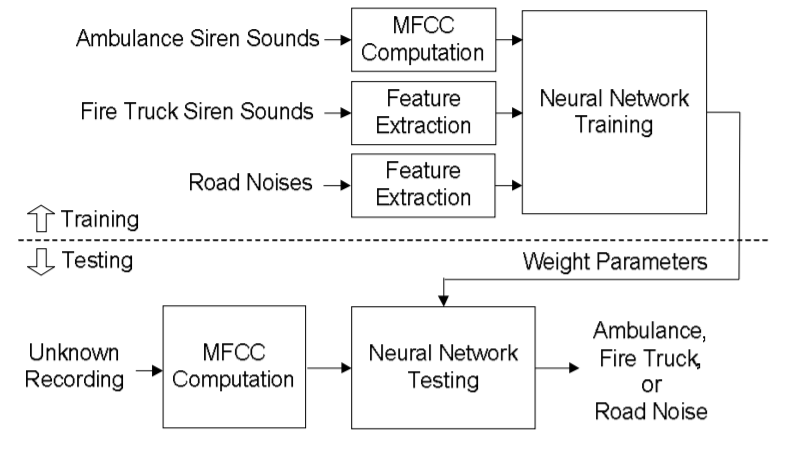

# AcousticDL-EmergencySounds

The implementation of a typical neural network for
Emergency Sounds Identification includes three steps: training, validation and testing. In the training stage, the extracted MFCC features of training dataset are provided as input to estimate the weight parameters in a neural network.
In the validation phase, we use the validation dataset
to evaluate the performance of trained model, and
through this basis to tune the parameters to achieve
the best one. Lastly, in the testing phase we pass the
unknown audio signal to the fully-trained network to
obtain corresponding output, the output with
maximum response value is selected as identified
result. 

## Signal Processing Picture

 In time domain, the processing of signals on computers
is more complicated, so we will analyze the features
in the frequency domain instead. In addition, since
the sound data is large in both time and frequency
domain, in order to reduce the amount of data to be
processed, the short-term features must be extracted
to represent the audio segments. Currently, the widely
used features in audio signal processing are Perceptual Linear Prediction (PLP) coefficients, Linear Prediction
Coefficients (LPC) and Mel-Frequency Cepstral
Coefficients (MFCCs). In general, [MFCCs](https://en.wikipedia.org/wiki/Mel-frequency_cepstrum#:~:text=Mel%2Dfrequency%20cepstral%20coefficients%20(MFCCs,%2Da%2Dspectrum%22).) are used
as phonological feature parameters in speaker
recognition application. However, it has been
shown viable in emergency signal recognition system
effectively, and hence we use MFCCs in this
work as well. For every 3s of a sound signal, 5 segments each and ultimately 13- dimensional MFCCs are computed from their spectral representations known as spectograms, derived with the help of the librosa library. 

## Artificial Neural Network Picture

A dense neural network implementation is done using Keras. 'Relu' activation along with a 30% dropout in hidden layers makes the model prevent overfitting. 'Softmax' activation is used in the final three-way classifier output layer. 'Adam' Optimizer helps in learning the data (MFCC vectors) by tuning weights of the hidden layers.

## Packages used

- `numpy  1.18.5`
- `tensorflow 2.3.1`
- `librosa 0.8.0`

## Training Datasets:  
- https://www.kaggle.com/vishnu0399/emergency-vehicle-siren-sounds
